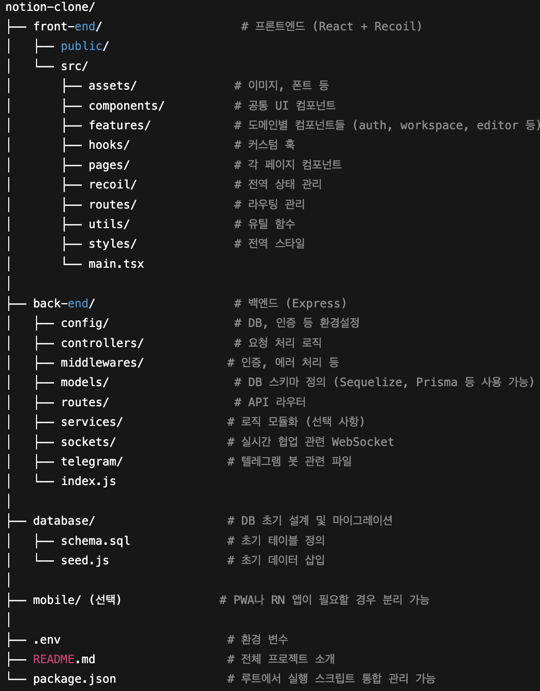

# 노션 클론 프로젝트

노션 클론 프로젝트는 React와 Recoil을 기반으로 기본 워크스페이스 및 페이지 CRUD 기능 구현을 목표로 하고 있습니다.  
백엔드 서버는 Node.js와 Express로 REST API를 제공하며, SQLite로 데이터 저장을 담당합니다.

---

## 프로젝트 폴더 구조

---

## 각 구성별 README

- [Back-End (서버)](back-end/README.md) : Node.js 기반 REST API 서버 및 DB 관리
- Front-End (클라이언트) : 현재 개발 중으로, 준비되는 대로 별도 README 추가 예정

---

## 프로젝트 개요

- React + Recoil 기반 프론트엔드 상태관리 및 페이지 구성
- Node.js + Express 기반 백엔드 API 서버 구축